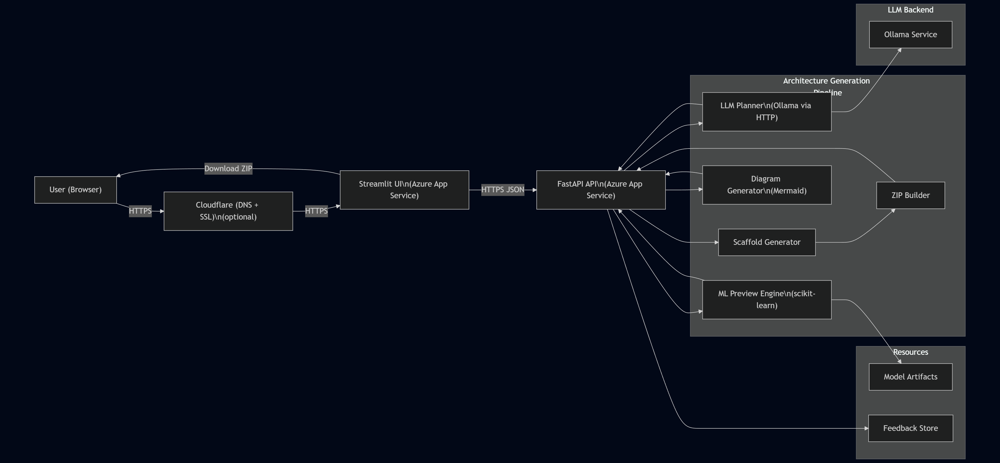
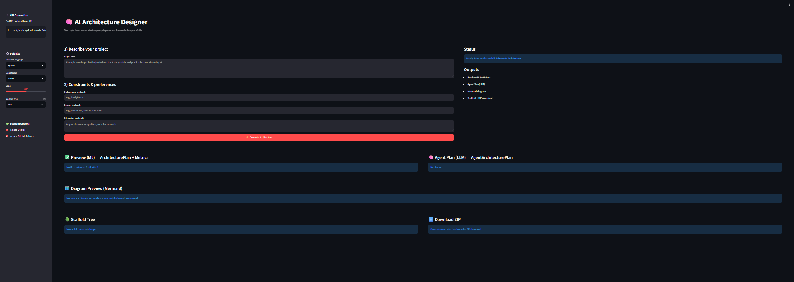
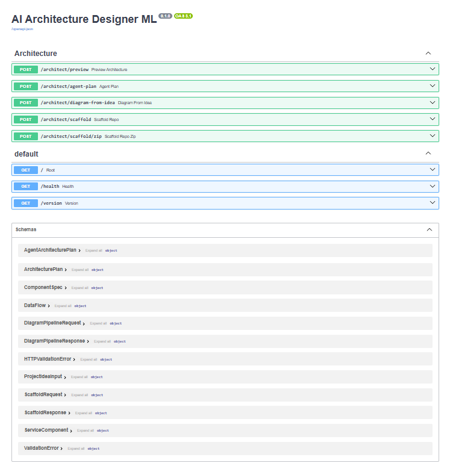
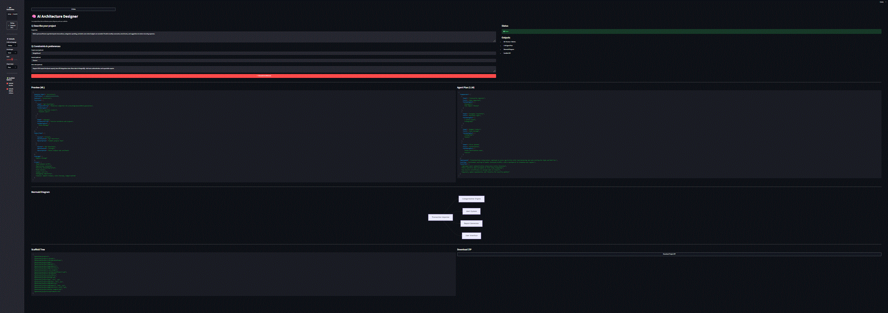

# 🏗️ AI Architecture Designer (ML + LLM)

**An Applied Machine Learning Approach to Automated Software Architecture Recommendation**

ML + LLM system that investigates whether **supervised machine learning models**, combined with a structured planning component, can predict **software architecture patterns, infrastructure components, and deployment complexity** from natural-language project descriptions.

<p align="center">
  
  
  
  
  
  
</p>

## 🌐 Live App URLs

- **UI (Streamlit):** https://arch.ai-coach-lab.com  
- **API (FastAPI):** https://arch-api.ai-coach-lab.com  
- **API Docs (Swagger):** https://arch-api.ai-coach-lab.com/docs  
- **Health:** https://arch-api.ai-coach-lab.com/health  

> These interfaces are provided for **demonstration and reproducibility**.  
> The primary contribution of this project is the **machine learning models and their evaluation**, not the UI.

## 📌 Project Overview

This project investigates whether **applied machine learning techniques** can be used to support software architecture recommendation tasks that are traditionally guided by experience or informal heuristics.

The system is designed as an **applied machine learning research project**, with a working software prototype included to demonstrate and validate experimental results.

The primary contribution of this work is the **design, training, and evaluation of explicit ML models**.  
A large language model (LLM) is used **only after ML inference** to convert predictions into structured, human-readable architecture plans.

## 🎯 Research Objectives

This project addresses the following research questions:

- Can supervised ML models accurately classify software architecture patterns from textual project descriptions?
- Can regression models estimate relative system complexity or deployment risk?
- How do ML-based predictions compare against simple baseline methods?

The emphasis is on **quantitative evaluation, reproducibility, and interpretability**, consistent with applied machine learning coursework expectations.

## 🧠 Machine Learning Components

The system includes multiple independently trained and evaluated ML models:

| Model | Task | Evaluation Metrics |
|------|------|-------------------|
| Architecture Pattern Classifier | Predict system type (monolith, microservices, data platform, ML system) | Accuracy, Precision, Recall, F1 |
| Component Recommendation Model | Recommend infrastructure components | Precision@K, Recall@K |
| Complexity / Risk Regressor | Estimate deployment or maintenance complexity | RMSE, R² |
| Baseline Models | Comparative benchmarks | Performance vs learned models |

### Feature Sources
- Textual embeddings derived from project descriptions  
- Encoded project attributes (e.g., cloud usage, data requirements)  
- Optional graph-derived architecture indicators  

Baseline approaches (e.g., TF-IDF + Logistic Regression, mean regression) are implemented for comparison.

## 📊 Experimental Evaluation

All ML models are trained and evaluated using **explicit train / validation / test splits**.

Evaluation artifacts include:
- Metric tables
- Confusion matrices (classification)
- Error and loss curves (regression)
- Baseline vs ML model comparisons

All experiments are reproducible using scripts provided in the repository.

## 🧩 Role of the LLM (Clarification)

The large language model **is not used as a predictive model** and is **not trained or evaluated**.

Its role is limited to:
- Converting ML predictions into structured architecture plans
- Enforcing schema validity (via Pydantic)
- Producing deterministic JSON outputs

All learning, prediction, and evaluation occur exclusively in the ML components.

## 🏗️ System Architecture

### Production Architecture

Mermaid source (version-controlled):

- `docs/diagrams/architecture-prod.mmd`

Rendered image:

- `docs/screenshots/architecture-prod.png`



### High-Level Flow

1. User enters a project description  
2. ML models generate predictions and confidence scores  
3. Structured planner converts predictions into an architecture specification  
4. Supporting services generate diagrams and repository scaffolds  
5. Outputs are shown in the UI and downloadable  

## 🖼️ App Preview

### Streamlit UI


### API Documentation (Swagger)


### Demo Walkthrough


## 🗂️ Repository Structure (Relevant to Coursework)

```text
data/                 # Dataset files and descriptions
models/               # Trained ML models
evaluation/           # Metrics, plots, confusion matrices
app/                  # FastAPI backend
ui/                   # Streamlit interface
docs/                 # Diagrams, screenshots
docker/               # Reproducible deployment

## 🚀 Local Development (Docker)

### ✅ Local URLs

```text
- **UI:** <http://localhost:8501>  
- **API:** <http://localhost:8000>  
- **Docs:** <http://localhost:8000/docs>
- **Health:** <http://localhost:8000/health

### ▶ Start Services

```powershell
docker compose up --build
