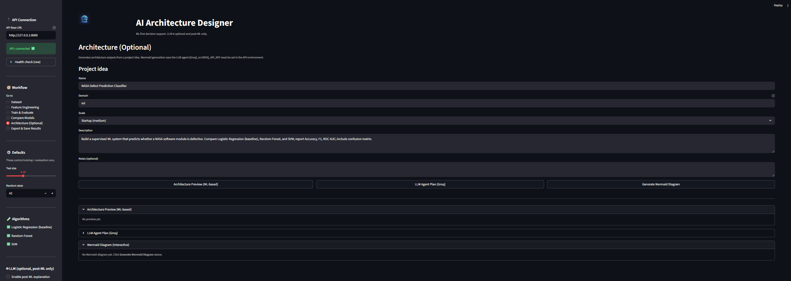
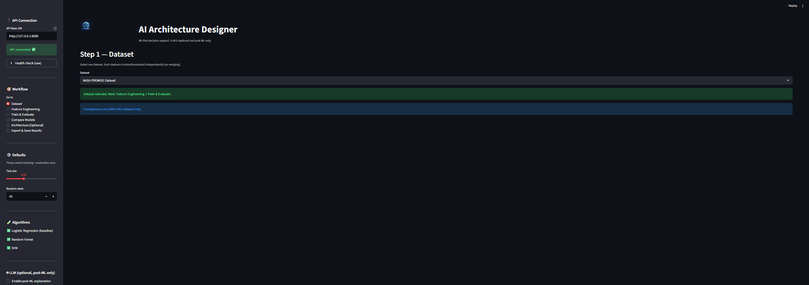
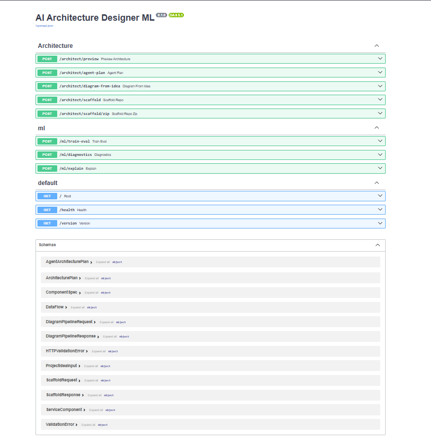
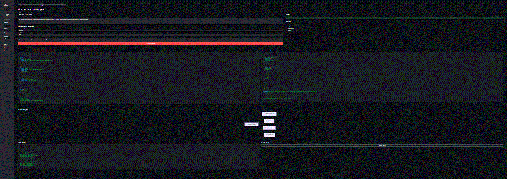

# 🏗️ AI Architecture Designer (ML-First Decision Support)

**An Applied Machine Learning System for Early-Stage Software Architecture Recommendation**

AI Architecture Designer investigates whether **supervised machine learning models** trained on **real labeled engineering datasets** can provide **empirically evaluable decision support** for early-stage software architecture design. Natural-language project descriptions are used as inputs, but the **core contribution is ML training + evaluation**, not an LLM agent.

> ⚠️ This project is **ML-first**.  
> The UI and LLM components exist **only to demonstrate ML results**, not to replace them.

<p align="center">
  
  
  
  
  
  
</p>

## 🌐 Live App URLs

- **UI (Streamlit):** https://arch.ai-coach-lab.com  
- **API (FastAPI):** https://arch-api.ai-coach-lab.com  
- **API Docs (Swagger):** https://arch-api.ai-coach-lab.com/docs  
- **Health:** https://arch-api.ai-coach-lab.com/health  

> These interfaces are provided for **demonstration and reproducibility**.  
> The primary contribution of this project is the **machine learning models and their evaluation**, not the UI.

## 📌 Project Motivation

Early software architecture decisions are **high-impact and difficult to reverse**, yet they are often made using informal heuristics or prior experience.

Modern systems introduce additional complexity through:
- cloud platforms
- data pipelines
- machine learning components

This project explores whether **supervised machine learning** can provide **consistent, measurable, and reproducible decision support** for these early design choices.

## 📂 Datasets (Professor Requirement)

This project uses **real labeled datasets** so that models can be **trained and evaluated empirically** (train/validation/test splits). The system is not an “LLM-only” project.

- **NASA PROMISE Software Defect Dataset (MW1)**  
  Software module metrics (e.g., McCabe/Halstead-style metrics) with **defect labels** used for supervised learning evaluation.  
  Source: https://openscience.us/repo/defect/mccabehalsted/mw1.html

- **Google Cluster Workload Traces (Google Cluster Data)**  
  Large-scale workload traces (resource usage / scheduling behavior) used to derive **system behavior and complexity signals**.  
  Source: https://github.com/google/cluster-data

- **NASA Benchmark Defect Dataset Collection (Mendeley)**  
  Multi-dataset benchmark collection for **robustness testing and cross-dataset validation**.  
  Source: https://data.mendeley.com/datasets/923xvkk5mm/1

> Dataset usage is documented under `data/` (raw/processed) and experiment scripts produce reproducible artifacts.

## 🎯 Research Questions

This project addresses the following applied ML questions:

- Can supervised ML models learn architecture decision signals using labeled engineering datasets?
- Can regression models estimate relative deployment or system complexity from derived system metrics?
- How do learned ML models compare against explicit **baseline methods**?

The emphasis is on **evaluation, comparison, and interpretability**, consistent with graduate-level applied ML expectations.

## 🧠 Machine Learning Contributions (Core)

### Algorithms Evaluated

| Algorithm | Purpose |
|---------|--------|
| Logistic Regression | Interpretable baseline |
| Random Forest | Non-linear ensemble |
| Support Vector Machine (SVM) | High-dimensional feature modeling |

Multiple algorithms are required to:
- establish baselines
- justify performance claims
- meet empirical ML standards

## 📊 Learning Tasks & Metrics

| Task | Model Type | Metrics |
|----|----------|--------|
| Architecture Pattern Classification | Classification | Accuracy, Precision, Recall, F1, ROC-AUC |
| Component Recommendation | Ranking / Multi-Label | Precision@K, Recall@K |
| Deployment Complexity Estimation | Regression | RMSE, R² |
| Baseline Comparison | Control Models | Relative performance |

All models use **train / validation / test splits**.

## 🧩 Feature Engineering

Features are derived from:
- natural-language project descriptions (vectorized text)
- encoded system attributes (scale, data intensity, cloud usage)
- structured metadata indicators
- dataset-driven engineering metrics (software metrics and workload signals)

Baseline feature pipelines are implemented for comparison.

## 📈 Experimental Evaluation

Evaluation artifacts include:
- ACM-style result tables
- confusion matrices
- regression error analysis
- baseline vs ML model comparisons

All experiments are **reproducible** using scripts in this repository.

## 🧠 Role of the LLM (Clarification)

A hosted LLM via the **Groq API** is used **only after ML inference**.

### The LLM is NOT used for:
- learning
- prediction
- evaluation
- optimization

### The LLM is used only for:
- formatting ML outputs into structured architecture plans
- enforcing schema validity
- improving human readability

The LLM can be removed without affecting ML results.

## 🏗️ System Architecture

### High-Level ML-First Flow

1. User submits a project description  
2. Feature extraction pipeline processes input  
3. ML models generate predictions and confidence scores  
4. Optional planner formats results  
5. Outputs are displayed via API and UI  

### 📐 Production Architecture Diagram



> Mermaid source: `docs/diagrams/architecture-prod.mmd`

## 🖼️ Application Screenshots

### Streamlit UI — Architecture Recommendations



### FastAPI — Swagger Documentation



### End-to-End Demo Walkthrough



## 🗂️ Repository Structure (Course-Relevant)

```text
data/           # Datasets and documentation (raw/processed)
artifacts/      # Models, preprocessors, metrics/results.json
app/            # FastAPI backend + ML pipeline + schemas
ui/             # Streamlit UI (demonstration only)
docs/           # Diagrams and screenshots
docker/         # Reproducible environment
scripts/        # Training/evaluation utilities
tests/          # (optional) tests for core logic
